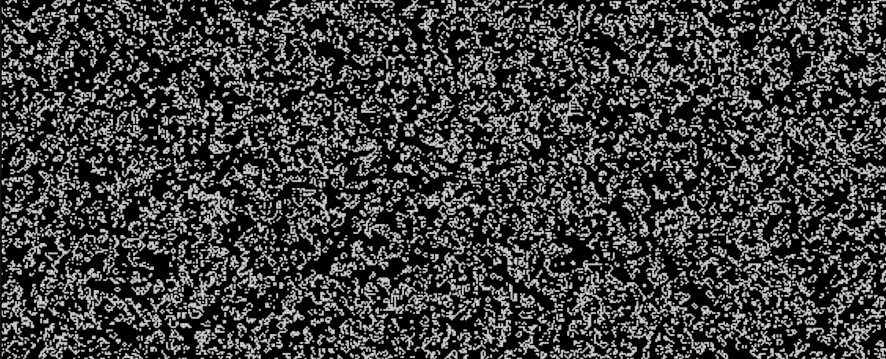

# Conway's Game of Life in Rust + Bevy

A real-time implementation of **Conway's Game of Life** built with **Rust** and the **Bevy game engine**.

The project simulates a cellular automaton where cells evolve according to Conway's rules. The simulation runs on a toroidal grid, meaning that the edges of the world wrap around.



---

## Features

* 🦀 Written in Rust
* 🎮 Built with the Bevy game engine
* 🧬 Conway's Game of Life simulation
* 🎲 Random world generation
* ⚡ Real-time simulation
* 🔄 Toroidal world with wrapped edges
* ⏯️ Pause and resume simulation
* 🔁 Generate a new random world
* 💾 Compact world representation using `Vec<bool>`

---

## Requirements

You need:

* Rust
* Cargo

Install Rust using the official installer:

https://www.rust-lang.org/tools/install

Verify your installation:

```bash
rustc --version
cargo --version
```

---

## Getting Started

Clone the repository:

```bash
git clone https://github.com/CodeByMaxx/rust-game-of-life.git
cd rust-game-of-life
```

Run the application:

```bash
cargo run
```

---

## Controls

| Key     | Action                        |
| ------- | ----------------------------- |
| `Space` | Pause / resume the simulation |
| `R`     | Generate a new random world   |

---

## How It Works

The simulation maintains two worlds:

```text
current
   |
   | calculate next generation
   v
next
```

For each generation:

1. The current world is read.
2. The number of neighbors for each cell is calculated.
3. Conway's Game of Life rules are applied.
4. The next generation is written to the next world.
5. The worlds are swapped.

This separation keeps the current generation independent from the generation being calculated.

---

## Conway's Game of Life

Each cell checks its **8 neighboring cells**.

### Living Cells

A living cell survives when it has:

* 2 neighbors
* 3 neighbors

A living cell dies when it has:

* fewer than 2 neighbors — underpopulation
* more than 3 neighbors — overpopulation

### Dead Cells

A dead cell becomes alive when it has:

* exactly 3 neighbors

These simple rules create complex and continuously evolving patterns.

---

## Technical Details

### World Size

The current simulation uses a grid of:

```text
150 × 100 cells
```

Each cell is rendered at:

```text
6 × 6 pixels
```

### Data Representation

The world is stored as a one-dimensional Rust vector:

```rust
Vec<bool>
```

For example:

```text
false false true
false true  true
false false false
```

represents:

```text
. . #
. # #
. . .
```

A two-dimensional position is converted into an array index using:

```rust
index = y * WIDTH + x
```

This provides a compact representation of the simulation state.

---

## Toroidal World

The simulation uses a **toroidal world**, so there are no real borders.

The edges wrap around:

```text
0 1 2 3 4
^         |
|_________|
```

Moving beyond the left edge brings a cell back on the right side.

Likewise, moving beyond the top brings it back at the bottom.

The coordinate wrapping is implemented using Rust's:

```rust
rem_euclid()
```

This creates a continuous looping simulation without boundary conditions.

---

## Project Structure

```text
rust-game-of-life
│
├── Cargo.toml
├── Cargo.lock
│
└── src
    └── main.rs
```

---

## Main Systems

The application is divided into separate systems for simulation, rendering, and input.

### Simulation

The `update_game()` system calculates the next generation.

Responsibilities:

* Count neighboring cells
* Apply Conway's rules
* Generate the next world state

### Rendering

The `draw_game()` system is responsible for displaying the simulation.

Responsibilities:

* Identify living cells
* Calculate screen positions
* Draw the cells

### Input

The `keyboard()` system handles keyboard interaction.

Responsibilities:

* Pause and resume the simulation
* Generate a new random world

---

## Technologies

| Technology | Purpose                          |
| ---------- | -------------------------------- |
| **Rust**   | Application and simulation logic |
| **Bevy**   | Game engine and rendering        |
| **Rand**   | Random world generation          |
| **Cargo**  | Build and dependency management  |

### Bevy

https://bevyengine.org/

### Rand

https://crates.io/crates/rand

---

## Future Improvements

Planned features include:

* [ ] Mouse interaction
* [ ] Add and remove cells manually
* [ ] Camera movement
* [ ] Zoom functionality
* [ ] Load predefined patterns
* [ ] Gosper Glider Gun
* [ ] Infinite world simulation
* [ ] Texture-based rendering
* [ ] GPU acceleration

---

## License

This project is licensed under the **MIT License**.

